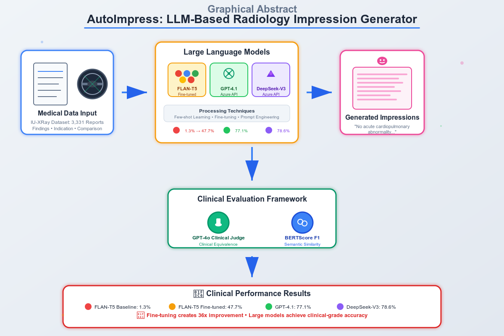

# AutoImpress: LLM-Based Radiology Impression Generator


*Automated clinical impression generation from structured radiology reports using Large Language Models*

**[📊 Results](#-key-results) • [🚀 Quick Start](#-quick-start) • [📖 Documentation](#-project-structure) • [🎯 Architecture](#-methodology)**

---
## 📋 Table of Contents

- [🎯 Overview](#-overview)
- [🖼️ Graphical Abstract](#️-graphical-abstract)
  - [🎪 Problem Statement](#-problem-statement)
  - [🏆 Key Contributions](#-key-contributions)
- [👥 Team](#-team)
- [📦 Project Structure](#-project-structure)
  - [📊 Output File Meanings](#-output-file-meanings)
- [🚀 Quick Start](#-quick-start)
- [🏥 Dataset](#-dataset)
  - [📊 Dataset Statistics](#-dataset-statistics)
  - [🔧 Preprocessing Steps](#-preprocessing-steps)
- [🧠 Methodology](#-methodology)
  - [🤖 Models Evaluated](#-models-evaluated)
  - [🔄 Processing Pipelines](#-processing-pipelines)
  - [📏 Evaluation Metrics](#-evaluation-metrics)
- [🏆 Key Results](#-key-results)
- [💡 Key Insights](#-key-insights)
- [🔬 References](#-references)
- [🙏 Acknowledgments](#-acknowledgments)

---

## 🎯 Overview

AutoImpress is a comprehensive research project that explores **automated clinical impression generation** from structured radiology report fields using state-of-the-art Large Language Models (LLMs). The project benchmarks multiple approaches including fine-tuning and prompt engineering on the **IU-XRay dataset**.

## 🖼️ Graphical Abstract



### 🎪 Problem Statement
- **Input**: Structured radiology report fields (Findings, Indication, Comparison, etc.)
- **Output**: Concise, clinically accurate impression summaries
- **Challenge**: Bridging the gap between surface-level text similarity and clinical equivalence

### 🏆 Key Contributions
- Novel evaluation framework using GPT-4o clinical judgment
- In-depth analysis of model agreement and disagreement patterns
- Practical insights for medical NLP applications

---

## 👥 Team

| Team Member | 
|-------------|
| **Yaniv Grosberg** |
| **Netanel Ohev Shalom** |
| **Aviel Shmuel** | 

---

## 📦 Project Structure

```
AutoImpress/
├── 📁 data_raw/                     # Raw datasets
│   └── indiana_reports.csv
├── 📁 data_cleaned/                 # Processed datasets  
│   └── indiana_reports_cleaned.csv
├── 📁 outputs/
│   ├── 📁 flan-t5-base/            # FLAN-T5 results
│   │   ├── generated_impressions_300_flan.csv
│   │   ├── finetuned_model_test_results.csv
│   │   ├── results_with_azure_gpt_judgment_baseline.csv
│   │   └── results_with_azure_gpt_judgment.csv
│   ├── 📁 gpt-deepseek/            # GPT-4.1 & DeepSeek results
│   │   ├── gpt41_judged_results.csv
│   │   ├── deepseek_judged_results.csv
│   │   ├── gpt4_1_acute_findings_vs_ground_truth.csv
│   │   └── deepseek_acute_findings_vs_ground_truth.csv
│   └── 📁 Analyze_Results_outputs/  # Analysis outputs
│       └── judgment_phrase_summary.csv
├── 📁 notebooks/
│   ├── 📓 Preprocessing_EDA.ipynb   # Data exploration & cleaning
│   ├── 📓 flan-t5-base.ipynb       # FLAN-T5 training & evaluation
│   ├── 📓 gpt_deepseek.ipynb       # API-based model evaluation
│   └── 📓 Analyze_Results.ipynb    # Comprehensive results analysis
├── 🐍 utils_file.py                # Shared utility functions
├── 📋 requirements.txt             # Python dependencies
└── 📖 README.md                    # Project documentation
```

### 📊 Output File Meanings
- **`uid`**: Unique identifier for each report
- **`generated_impression`**: Model-generated clinical summary
- **`true_impression`**: Expert-labeled ground truth
- **`gpt_equivalence`**: GPT-4o clinical judgment (Yes/No)


---

## 🚀 Quick Start

### 1️⃣ Clone Repository
```bash
git clone https://github.com/Yanivgg/AutoImpress.git
cd AutoImpress
```

### 2️⃣ Install Dependencies
```bash
pip install -r requirements.txt
```

### 3️⃣ Run Analysis Pipeline
```bash
# Data preprocessing and EDA
jupyter notebook notebooks/Preprocessing_EDA.ipynb

# FLAN-T5 model training and evaluation
jupyter notebook notebooks/flan-t5-base.ipynb

# GPT-4.1 and DeepSeek evaluation
jupyter notebook notebooks/gpt_deepseek.ipynb

# Comprehensive results analysis
jupyter notebook notebooks/Analyze_Results.ipynb
```

### 4️⃣ Explore Results
Generated outputs will be saved in the `outputs/` directory with detailed CSV files for further analysis.

---

## 🏥 Dataset

### IU-XRay (Indiana University Chest X-ray Reports)
- **Original**: 3,955 radiology reports
- **After Preprocessing**: 3,331 records (~13% reduction)
- **Fields**: Findings, Indication, Comparison, Image, MeSH, Problems → **Impression**

### 📊 Dataset Statistics
- **Text Length**: Findings ≈ 190 chars, Impression ≈ 76 chars
- **Vocabulary**: ~2,000 unique tokens
- **Common Pattern**: 

| Phrase                                      | Count |
|--------------------------------------------|-------|
| No acute cardiopulmonary abnormality        | 491   |
| No acute cardiopulmonary findings           | 189   |
| No acute cardiopulmonary abnormalities      | 168   |
| No acute cardiopulmonary disease            | 163   |
| No acute disease                            | 126   |
| No acute cardiopulmonary process            | 106   |
| No acute radiographic cardiopulmonary process | 93  |
| No acute cardiopulmonary abnormality identified | 80 |
| No acute pulmonary disease                  | 76    |
| No acute findings                           | 60    |


### 🔧 Preprocessing Steps
- Removed ~520 incomplete records
- Filled missing fields with "none provided"
- Replaced anonymized patterns with `[REDACTED]`
- Cleaned non-clinical tokens for prompt optimization

---

## 🧠 Methodology

### 🤖 Models Evaluated

| Model                 | Type        | Configuration              | Platform             |
|-----------------------|------------|----------------------------|----------------------|
| **FLAN-T5 Base**      | Baseline   | Few-shot prompting         | Google Colab (GPU)   |
| **FLAN-T5 Fine-tuned**| Fine-tuned | 3 epochs, batch size 4     | Google Colab (GPU)   |
| **GPT-4.1**           | API-based  | Prompt engineering         | Azure API            |
| **DeepSeek-V3**       | API-based  | Prompt engineering         | Azure API            |


### 🔄 Processing Pipelines

#### FLAN-T5 Pipeline
```
Data → Few-shot Baseline → Fine-tune → Validation → GPT-4o Judge
```

#### GPT-4.1 & DeepSeek Pipeline
```
Data → 50% Sample → API Generation → BERTScore → GPT-4o Judge
```

### 📏 Evaluation Metrics

#### Primary Metric: GPT-4o Clinical Judge
- **Approach**: Binary YES/NO clinical equivalence assessment
- **Prompt**: Expert medical comparison with strict clinical criteria
- **Focus**: Clinical interpretability over surface similarity

#### Secondary Metric: BERTScore F1
- **Purpose**: Semantic similarity measurement
- **Range**: 0-1 (higher = more similar)
- **Limitation**: May not capture clinical nuances

---
## 🏆 Key Results
###

> Fine-tuning with FLAN-T5 significantly improves clinical equivalence from 1.3% to 47.7%, while large models like GPT-4.1 and DeepSeek exceed 77%.

###

> Highlights include 36x improvement via fine-tuning, 129 flipped cases, and analysis of 3,331 radiology reports.

###

> Strong agreement (83.7%) between GPT-4.1 and DeepSeek shows reliable model alignment for clinical judgment.

###

> A clear visual ranking of models based on clinical equivalence outcomes.

###

> Visual breakdown of model performance on simple vs. complex patterns. FLAN-T5 benefits most from fine-tuning in both cases.

###

> Different phrase types affect model agreement. "No acute" phrases show ~90% agreement, while complex and borderline cases reduce alignment.

###

> Fine-tuning changed 129 cases from “No” to “Yes”. This major improvement highlights the effectiveness of domain adaptation.

###

> Breakdown of Clinical Equivalence, BERTScore F1, sample counts, and key takeaways for each model. Includes both semantic and clinical accuracy perspectives.

---

## 💡 Key Insights

### 🎯 Technical Insights
1. **Fine-tuning is Crucial**: Baseline FLAN-T5 performed poorly (1.3%) but fine-tuning achieved 47.7%
2. **Large Models Excel**: GPT-4.1 and DeepSeek reached ~78% without domain-specific training
3. **Prompt Engineering Matters**: Multiple refinement rounds were essential for optimal performance
4. **Clinical ≠ Semantic**: High BERTScore doesn't guarantee clinical equivalence

### 🏥 Clinical Implications
1. **Pattern Templates**: Dataset's repetitive nature aids prompt steering but may limit generalization
2. **"No Acute" Advantage**: Models perform better on normal findings vs. complex pathology
3. **Human Validation Essential**: Even best models miss ~22% of clinical nuances
4. **Structured Input Benefits**: Organized report fields improve generation quality

### 🔬 Research Contributions
1. **Evaluation Framework**: Novel use of GPT-4o for clinical judgment evaluation
2. **Comprehensive Benchmarking**: Systematic comparison across model types and sizes
3. **Practical Insights**: Real-world applicability analysis for medical NLP systems
4. **Open Science**: Full reproducible pipeline with detailed analysis

---

## 🔬 References

### 📚 Key Papers
- **Zhang et al. (2023)**: *Leveraging Summary Guidance on Medical Report Summarization* - Fine-tuning BART/T5 on medical reports, achieved superior performance on DISCHARGE and ECHO datasets
- **Ma et al. (2023)**: *From General to Specific: Domain Adaptation for Medical Report Generation* - HybridFusion approach combining general and medical LLMs, SOTA results on MIMIC-CXR
- **Van Veen et al. (2023)**: *RadAdapt: Lightweight Domain Adaptation of LLMs* - Efficient LoRA/Prefix tuning achieving clinical validation with minimal parameters

### 🛠️ Technical Stack
- **Models**: FLAN-T5, GPT-4.1, DeepSeek-V3
- **Evaluation**: BERTScore, GPT-4o Clinical Judge
- **Frameworks**: Transformers, PyTorch, Azure OpenAI API
- **Environment**: Google Colab Pro, VSCode, Jupyter Notebooks


## 🙏 Acknowledgments

- **Indiana University** for the IU-XRay dataset
- **Microsoft Azure** for providing free student accounts that enabled API access
- **Holon Institute Of Technology Academic Institution** for supporting this research project

---


**⭐ Star this repository if you find it useful! ⭐**

*For questions, issues, or collaboration opportunities, please open an issue or reach out to the team.*

